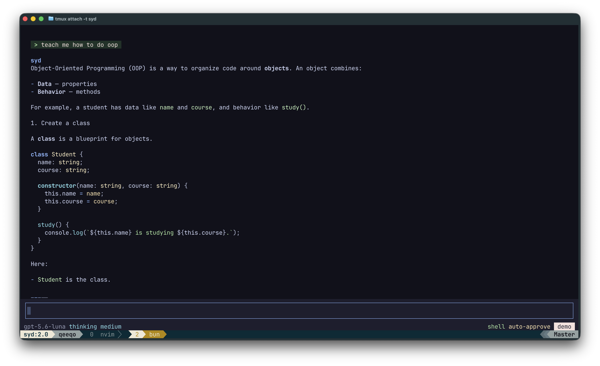
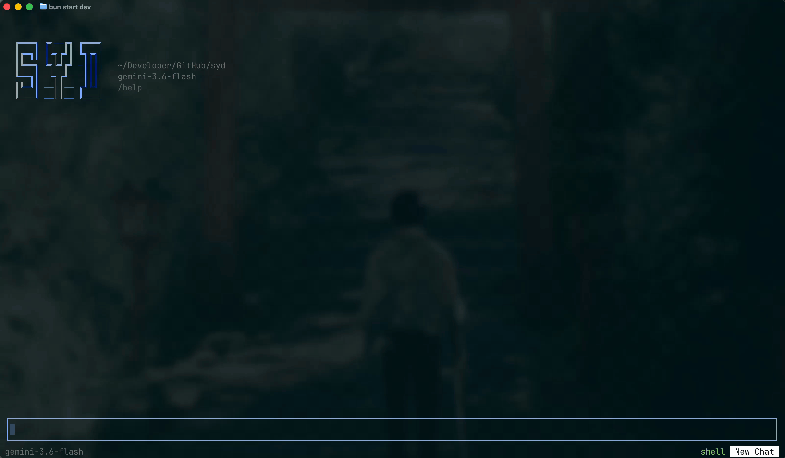
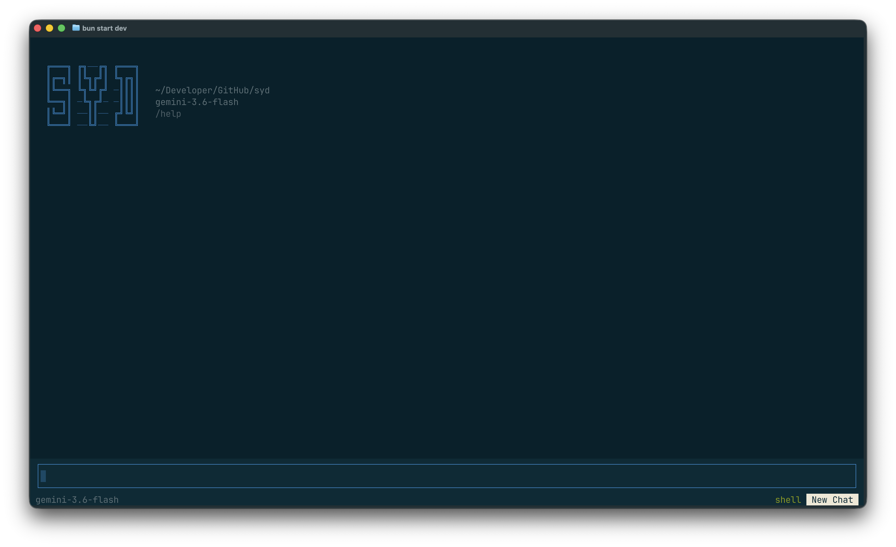
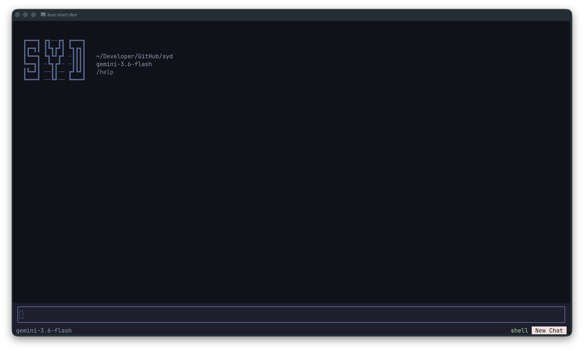
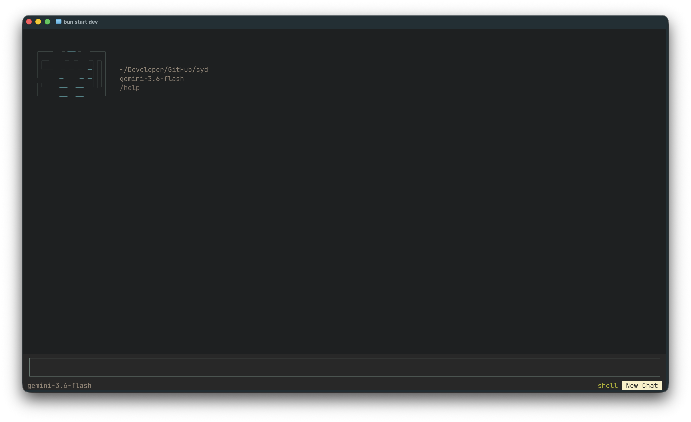

## About

An agentic AI coding assistant for the terminal — MCP servers, user-defined
skills, opt-in shell access, and a themed TUI, with human approval in front of
anything that changes your machine.

<p align="center">
  
</p>

> [!NOTE]
> **syd is alpha and not installable yet.** There is no published package and no
> release binary. It runs from source only, and things move around between
> commits. The repository is public but under active development.

- **Streaming chat** in the terminal, backed by the [Vercel AI SDK](https://sdk.vercel.ai).
  Google, Anthropic, and OpenAI via API key; OpenAI also via ChatGPT OAuth.
- **Agentic file tools** — syd can list, read, edit, write, and delete files in
  the project it's running in. Every change is shown as a red/green diff and
  gated behind your approval.
- **Shell access** (off by default) — run your project's own lint, tests, or
  build so syd can verify its work. Every command asks first, every time.
- **MCP servers** — connect any Model Context Protocol server over stdio or
  HTTP/SSE, including OAuth ones. Their tools are approval-gated by default.
- **Skills** — save reusable instructions and invoke them with `@name` in a
  message. Manage them in `/skills`, or just ask syd to write one.
- **Ask-the-user** — when a request is genuinely ambiguous, syd opens a question
  with selectable options instead of guessing.
- **Thinking levels** — one scale (`off`/`low`/`medium`/`high`) mapped onto each
  provider's own reasoning dialect.
- **Themes** — role-based theming with bundled palettes, plus a `system` theme
  that inherits your terminal's own colors and transparency.

## TUI

### Themes

<p align="center">
  
</p>

All themes (Solarized, Catppuccin, and Gruvbox)

<p align="center">
  
  
</p>
<p align="center">
  
</p>

## Running it from source

**Bun is required** — not Node. OpenTUI uses native FFI that only Bun's runtime
provides.

```bash
git clone https://github.com/qeeqo/syd.git
cd syd
bun install
bun run dev
```

Set a key for whichever provider you want, in your shell or a `.env` file:

```bash
GOOGLE_GENERATIVE_AI_API_KEY=...
ANTHROPIC_API_KEY=...
OPENAI_API_KEY=...
```

You can also add a key from inside syd with `/provider` — it's stored in
`~/.sydcli/auth.json` with permissions, never in the repo.

## Configuration

syd reads `~/.sydcli/config.json`. It's optional; every field has a default.

```json
{
  "theme": "system",
  "reasoning": "high",
  "shellEnabled": false,
  "autoApprove": false,
  "mcpServers": {
    "github": {
      "url": "https://api.githubcopilot.com/mcp/",
      "headers": { "Authorization": "Bearer ${GITHUB_TOKEN}" }
    },
    "notion": {
      "transport": "http",
      "url": "https://mcp.notion.com/mcp",
      "auth": "oauth"
    }
  },
  "skills": {
    "reviewer": { "instructions": "Review for correctness first, then style." }
  }
}
```

Secrets stay out of this file: `${VAR}` references in MCP `env` and `headers` are
expanded from your environment at connect time. A JSON schema for editor
autocomplete lives in [`config.schema.json`](./config.schema.json).

## Commands

`/help` lists them all in-app. The ones worth knowing early:

| Command               | What it does                              |
| --------------------- | ----------------------------------------- |
| `/model`, `/provider` | Switch model or provider (live catalogs)  |
| `/thinking`           | Set reasoning effort                      |
| `/settings`           | Toggle shell access and auto-approve      |
| `/skills`             | Create, edit, and delete skills           |
| `/mcp`                | Browse tools from connected MCP servers   |
| `/resume`             | Reopen a past session from this directory |
| `/theme`              | Pick a color theme                        |

## Development

```bash
bun run dev       # watch mode
bun run build     # typecheck (tsc -b, noEmit)
bun run lint      # eslint
bun run licenses  # regenerate THIRD_PARTY_LICENSES.md
```

There is no automated test suite yet.

## Contributing

syd is early enough that the architecture still shifts week to week, so I'm not
taking pull requests yet. Issues — bug reports, ideas, questions — are welcome.

## License

syd is released under the [MIT License](./LICENSE) — © 2026 qeeqo.

syd also bundles color themes derived from third-party open-source palettes
(Solarized, Gruvbox, Catppuccin), each under MIT terms, and depends on npm
packages under MIT, Apache-2.0, and BSD-3-Clause. Their copyright and permission
notices are reproduced in
[THIRD_PARTY_LICENSES.md](./THIRD_PARTY_LICENSES.md).

Product and theme names referenced here are the property of their respective
owners and are used for identification only.
